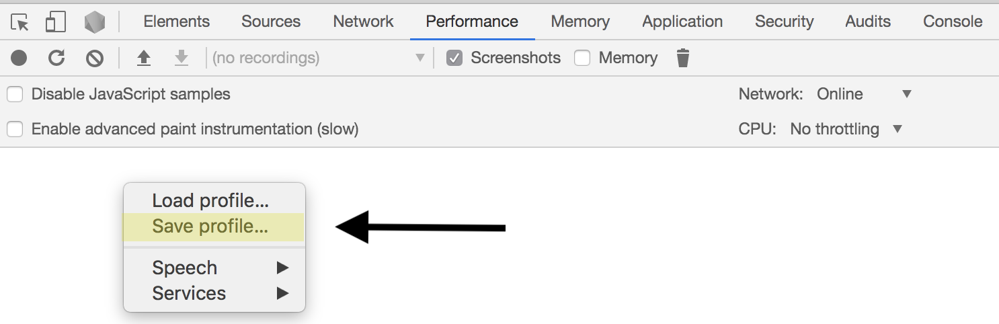

# trace2video

Extract a video from frames in a Chrome DevTools trace file.

## Usage

### With npm

```sh
npx trace2video trace.json
```

### With yarn

```sh
yarn dlx trace2video trace.json
```

## Exporting a Trace from Chrome

After running a trace in the `Performance` tab of DevTools, right click and choose `Save Profile`.


